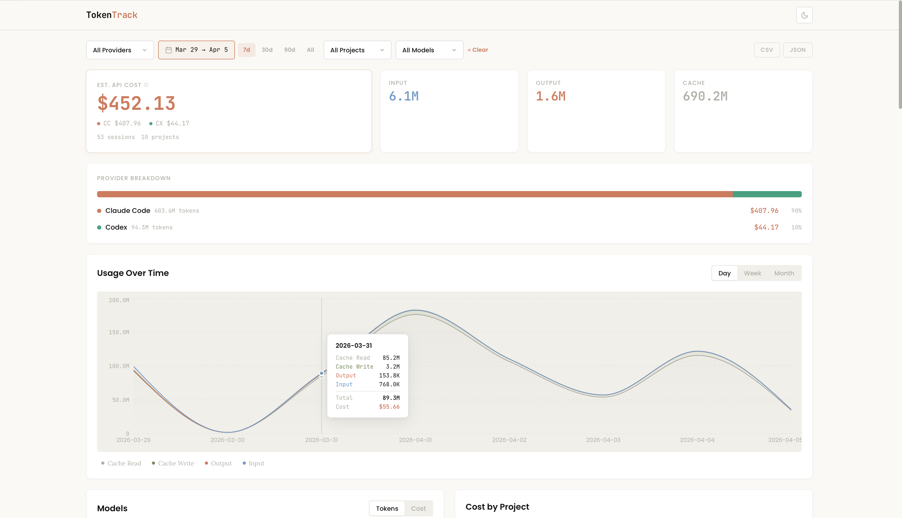

[](https://www.npmjs.com/package/tokentrack)
[](./LICENSE)
[](https://nodejs.org)
[](https://github.com/elishab60/tokentrack)

# ⚡ TokenTrack

*Track your AI coding agent token consumption across Claude Code and OpenAI Codex.*

**One command. Zero config. Nothing leaves your machine.**

```bash
npx tokentrack
```

---



---

## Quick Start

```bash
# Launch dashboard (opens browser)
npx tokentrack

# Terminal summary only
npx tokentrack --summary

# Export your data
npx tokentrack --export csv --output usage.csv

# Custom port
npx tokentrack --port 4200
```

Requires Node.js 18+. Works on macOS and Linux.

---

## Features

📊 **Dashboard** — KPI overview, usage over time chart, cost by project, activity heatmap

🔍 **Deep Dive** — session explorer with per-message breakdown, model distribution donut, provider comparison

📦 **Export** — CSV and JSON with filters applied, custom output path

🔒 **Privacy** — 100% local. Reads local log files only. No API keys. No accounts. Nothing sent anywhere.

---

## What It Reads

| Provider | Local Path | Data Tracked |
|----------|-----------|--------------|
| Claude Code | `~/.claude/projects/` | input, output, cache write, cache read |
| OpenAI Codex | `~/.codex/sessions/` | prompt, completion, cached input, reasoning |

No configuration needed — TokenTrack auto-detects both providers.

---

## About "Estimated API Cost"

TokenTrack shows an **estimated API-equivalent cost** — what your usage would cost at standard pay-per-token rates. This is a reference metric, not your actual bill.

- **Pro / Max / Plus subscribers** → you pay a flat fee. The cost shown helps you understand the value you're getting and how close you are to usage limits.
- **API key users** → the cost shown approximates your actual spend.

Pricing is fetched from [LiteLLM](https://github.com/BerriAI/litellm) (2600+ models) and verified within 1% of [ccusage](https://github.com/ryoppippi/ccusage).

---

## Demo Output

```
$ npx tokentrack --summary

✔ Parsed 4,218 usage records from Claude Code, Codex

  TokenTrack — Multi-Provider Usage Summary
  2026-03-01 → 2026-04-05

  ■ Claude Code        3,102 records │  8 projects │ $36.80
  ■ Codex              1,116 records │  5 projects │ $11.54

┌─────────────────┬─────────┐
│ Metric          │ Value   │
├─────────────────┼─────────┤
│ Total Tokens    │ 14.8M   │
│ Input Tokens    │ 1.2M    │
│ Output Tokens   │ 420.3K  │
│ Cache Tokens    │ 13.2M   │
│ Est. API Cost   │ $48.34  │
│ Sessions        │ 87      │
│ Projects        │ 11      │
└─────────────────┴─────────┘

  Projects
┌─────────────────┬──────────┬──────────┬───────┬────────┬────────┬────────┐
│ Project         │ Provider │ Sessions │ Input │ Output │ Cache  │ Cost   │
├─────────────────┼──────────┼──────────┼───────┼────────┼────────┼────────┤
│ project-alpha   │ CC CX    │ 32       │ 580K  │ 180K   │ 5.2M   │ $18.40 │
│ project-beta    │ CC       │ 18       │ 210K  │ 95K    │ 3.8M   │ $12.20 │
│ project-gamma   │ CX       │ 12       │ 390K  │ 78K    │ 2.1M   │  $8.60 │
└─────────────────┴──────────┴──────────┴───────┴────────┴────────┴────────┘
```

---

## CLI Reference

| Flag | Description |
|------|-------------|
| `tokentrack` | Launch dashboard in browser |
| `--summary` | Terminal-only summary, no browser |
| `--port <n>` | Custom server port (default: 3847) |
| `--export csv` | Export filtered data as CSV |
| `--export json` | Export filtered data as JSON |
| `--output <file>` | Specify export file path |
| `--pricing` | Display current pricing table |
| `--provider <name>` | Filter: `claude-code`, `codex`, or `all` |
| `--project <name>` | Filter by project name |
| `--from <date>` | Filter start date (YYYY-MM-DD) |
| `--to <date>` | Filter end date (YYYY-MM-DD) |

---

## Stack

TypeScript · React · Recharts · Hono · Tailwind · Zustand · Vite · tsup

---

## Install Size

📦 ~205 kB download · ~733 kB on disk

---

## Contributing

PRs welcome. Please open an issue first for major changes.

```bash
git clone https://github.com/elishab60/tokentrack.git
cd tokentrack
npm install
npm run dev
```

---

## Acknowledgments

Built on ideas from [ccusage](https://github.com/ryoppippi/ccusage) by [@ryoppippi](https://github.com/ryoppippi) — the reference CLI for Claude Code token tracking. TokenTrack adds a visual dashboard and multi-provider support.

---

## License

MIT — [Elisha Bajemon](https://github.com/elishab60)

---

*TokenTrack reads local data only. Nothing is sent anywhere. Your usage stays yours.*
